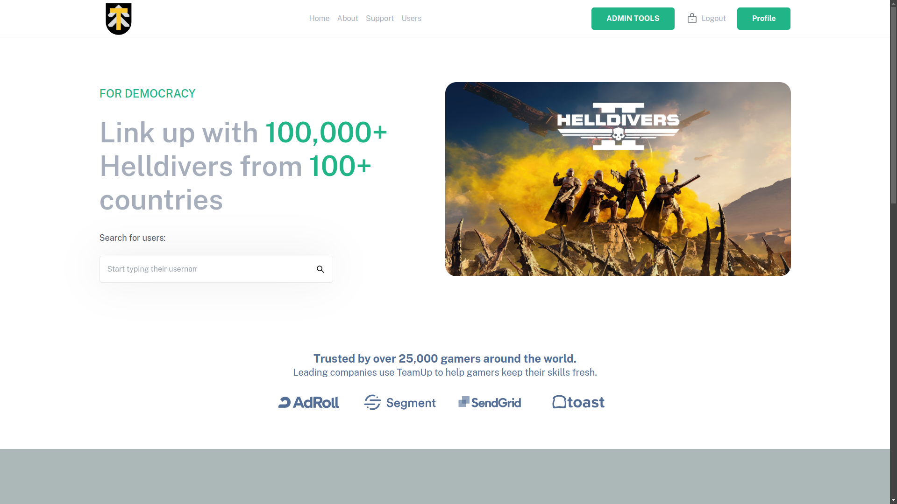
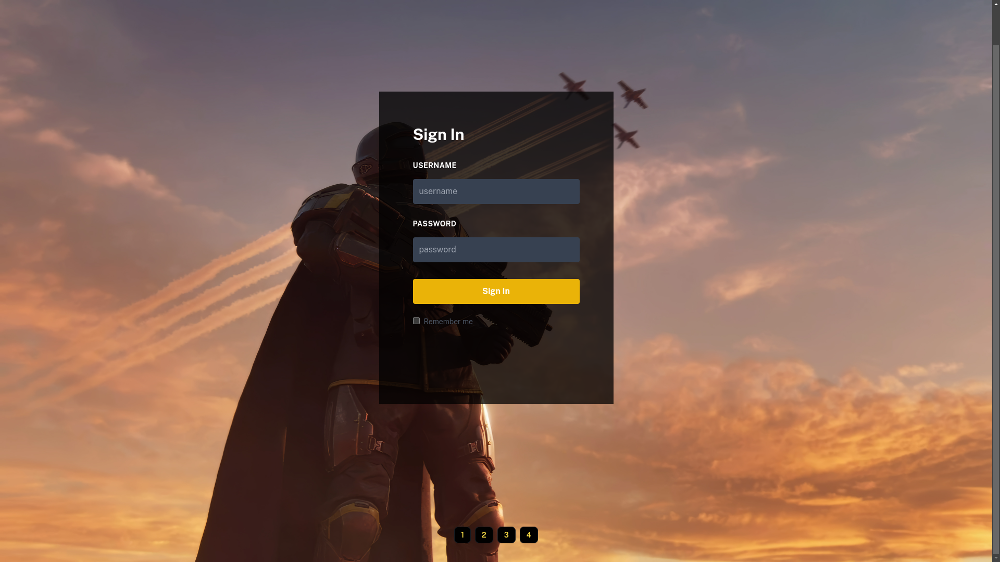
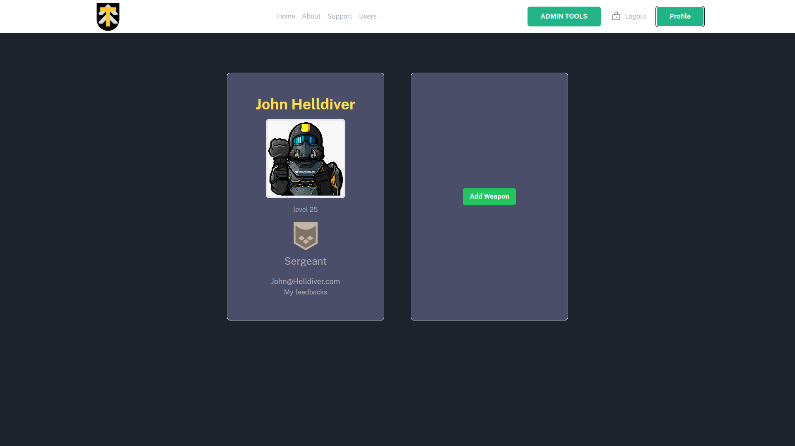

# Helldivers 2 Teammate and Guild Finder: TEAM UP

**TEAM UP** is a web platform designed for Helldivers 2 players to create and manage guilds, recruit members, and organize events. Players can reserve spots for upcoming events and receive notifications when the event starts, ensuring a seamless and coordinated gaming experience.

## Showcase

### Home page



### Login page



### Profile page



## Installation Instructions

### 1. Clone the Repository
To get started, clone the TEAM UP repository from GitHub:
```bash
git clone git@github.com:Szollobalint/TeamUp-public.git
```

### 2. Application Setup With Docker
Ensure you have Docker Desktop installed.

Create containers:

```bash
docker-compose build
```

Run the application:

```bash
docker compose up
```

### 3. Access the Application
   Open your web browser and go to http://localhost:5173

1. Register an Account
   Click on the "Sign Up" button on the homepage.
   Fill in your details and create an account.

   
### 4. Technologies Used

1. Backend:

[](https://www.oracle.com/java/)
[](https://spring.io/projects/spring-boot)
[](https://maven.apache.org/)
[](https://junit.org/junit5/)

2. Frontend:

[](https://developer.mozilla.org/en-US/docs/Web/JavaScript)
[](https://reactjs.org/)
[](https://vitejs.dev/)
[](https://tailwindcss.com/)
[](https://axios-http.com/)

3. Database:

[](https://www.postgresql.org/)
[](https://www.h2database.com/)

### 5. Contact Information
For support or inquiries, please contact:
- **Email: pzsombor.dev@gmail.com**
- **Email: szollosybalint24@gmail.com**
